# paperclip: Blog Project

> 깃&깃허브 연습을 위한 블로그 프로젝트

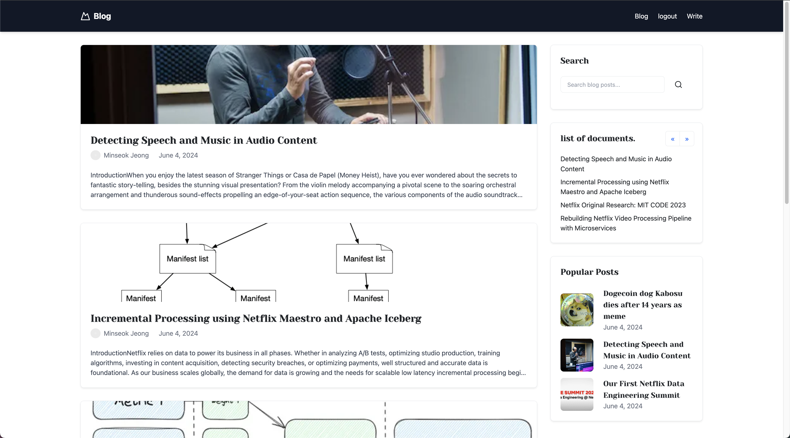

## 목차

- [들어가며](#들어가며)

  - [프로젝트 소개](#1-프로젝트-소개)
  - [프로젝트 기능](#2-프로젝트-기능)
  - [사용 기술](#3-사용-기술)
    - [백엔드](#3-1-백엔드)
    - [프론트엔드](#3-2-프론트엔드)
  - [실행 화면](#4-실행-화면)

- [설계](#구조-및-설계)
  - [DB 설계](#2-db-설계)

## 들어가며

### 1. 프로젝트 소개

세미 프로젝트를 본격적으로 들어가기 전 깃&깃허브를 연습하기 위해 2인 프로젝트를 진행하게되었다. 프로젝트의 주제를 선택할 때 수업시간에 배운 내용을 전반적으로 사용할 수 있는 주제를 선택하기 위해 블로그 프로젝트를 시작하게 되었다.

### 2. 프로젝트 기능

프로젝트의 주요 기능은 다음과 같습니다.

- **사이드바 -** 조회수 순 리스트 출력, 페이징 및 검색 처리, 날짜순 리스트 출력
- **사용자 -** Session 회원가입 및 로그인, 게시글 수정, 삭제, 생성 가능
- **댓글 -** CRUD 기능

### 3. 사용 기술

#### 3-1 백엔드

##### 주요 프레임워크 / 라이브러리

- Java 17
- SpringBoot 2.7.12
- Mybatis

##### Build Tool

- Maven

##### DataBase

- MySQL 8.0.3

#### 3-2 프론트엔드

- Html/Css
- JavaScript
- JSP
- Bootstrap 5.3.5

### 4. 실행 화면

  

    
게시글 관련
   
       
    
  **1. 메인 페이지**   
  
  게시글의 요약된 내용을 볼 수 있습니다.
     
  **2. 게시글 등록**   
  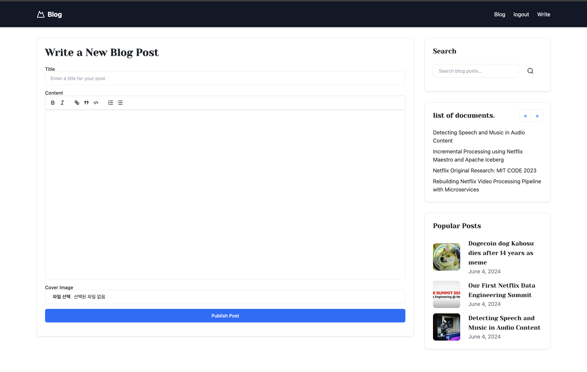   
  로그인한 사용자만 수정버튼이 보이고 수정할 수 있다.   
     
  **3. 게시글 수정**   
  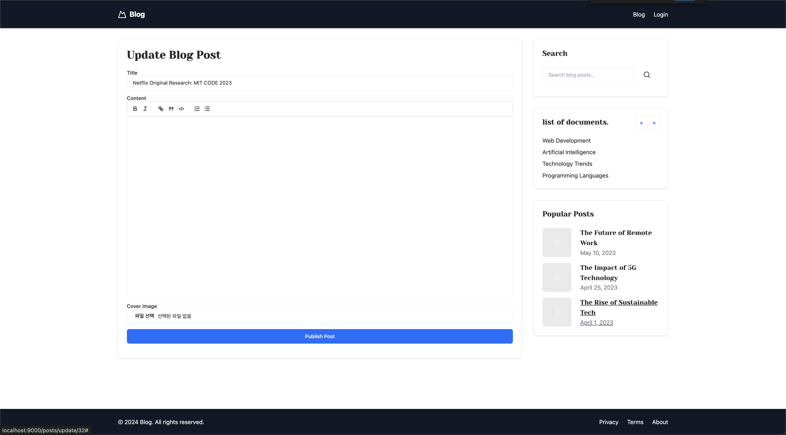   
  
  본인이 작성한 글만 수정 및 삭제가 가능하다.   
     
   **4. 게시글 상세**   
  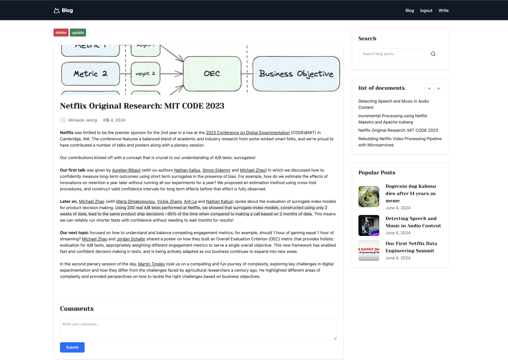   
  로그인이 되어있을 때는 수정 삭제 버튼을 누를 수 있다.
     
     
  

      
  
  

    
회원 관련
   
     
  **1. 회원가입 화면**   
  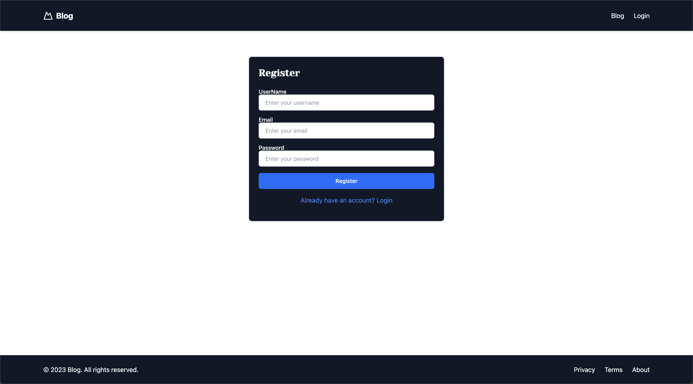   
  유저의 아이디와 비밀번호를 db에 저장한다.
     
  **2. 로그인 화면**   
  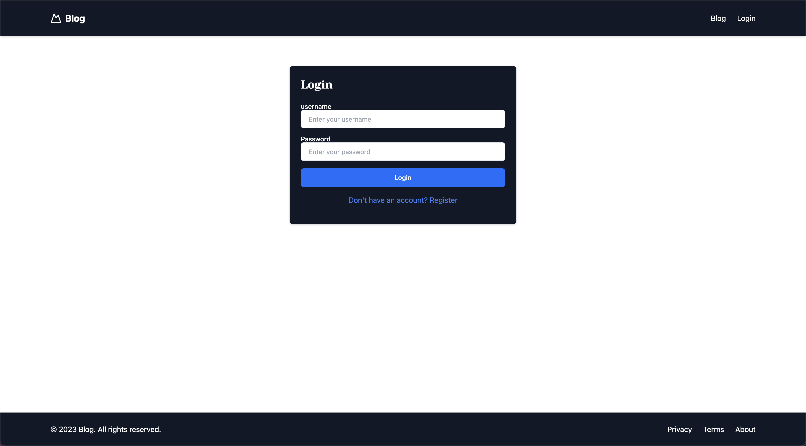
  유저의 아이디와 비밀번호가 db에 있는 것과 비교하여 같으면 Success 다르면 Fail 알람을 띄워준다.
     
     
           
  

      
  
  

    
댓글 관련
   
       
  **1. 댓글 작성 화면**     
  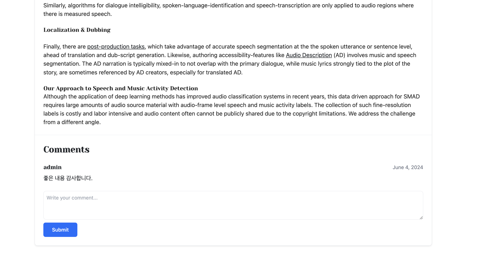      
  댓글은 로그인 한 사용자만 달 수 있다.
   
           
  

      
 
   
## 구조 및 설계

 
   
      
   
     
 ### 2. DB 설계

DB관계도
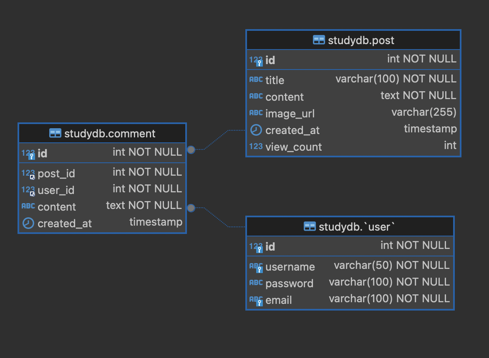

post
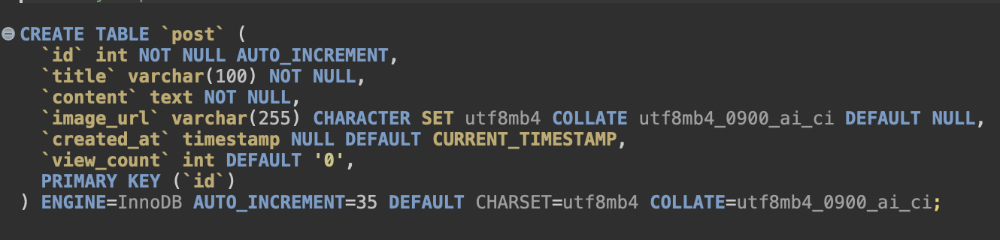

user
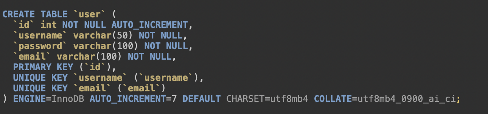

comment
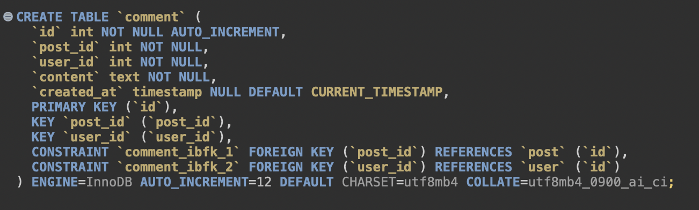

 
